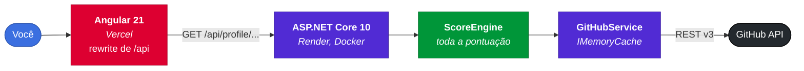

<div align="center">

# 🚀 DevProfile


**Transforma um perfil público do GitHub em um diagnóstico de senioridade: score, radar de competências, comparação entre devs e um card pronto para compartilhar**

[**Ver funcionando**](https://dev-profile-one.vercel.app) · [Stack](#stack) · [Arquitetura](#arquitetura) · [Como Usar](#como-usar) · [Decisões](#decisoes)

</div>

---

## Sobre

DevProfile lê dados públicos da [GitHub API](https://docs.github.com/rest) e devolve uma leitura interpretada do perfil: quanto a pessoa produz, com que consistência, em que stack e em que nível de senioridade isso a coloca. Toda a pontuação acontece no backend, no `ScoreEngine`; o Angular só desenha o resultado.

- **Score de senioridade (0 a 100)** com nível Júnior, Pleno ou Sênior
- **Radar de competências** em seis eixos, calculado no servidor e desenhado em SVG
- **Modo VS**: dois perfis lado a lado, com vencedor por score
- **Projeção de carreira**, demanda de mercado das suas linguagens e pitch pronto para copiar
- **Card compartilhável** em PNG, formato feed (1:1) ou story (9:16), tema claro ou escuro
- **Resposta crua**: qualquer rota aceita o sufixo `/json` e redireciona para o payload da API

---

## Stack

| Camada | Tecnologia |
|---|---|
| Backend | ASP.NET Core 10, `IMemoryCache`, `HttpClientFactory` com resiliência padrão, Swagger |
| Frontend | Angular 21 standalone, Signals, SCSS com design system próprio |
| Gráficos | SVG escrito à mão, sem biblioteca de visualização |
| Exportação | html2canvas |
| Testes | Vitest |
| Deploy | Vercel (web) e Render via Docker (API) |

---

<a id="arquitetura"></a>

## 🏗️ Arquitetura



O `ValueScore` é uma média ponderada de cinco sinais, cada um normalizado de 0 a 100 contra um teto fixo:

| Sinal | Peso | Teto |
|---|---|---|
| Commits totais | 30% | 2.000 |
| Tempo de conta | 20% | 8 anos |
| Diversidade de linguagens | 20% | 12 |
| Estrelas + forks | 15% | 500 |
| Consistência (commits por mês) | 15% | 25 |

Até 34 é Júnior, até 64 é Pleno, acima disso é Sênior. Os seis eixos do radar reaproveitam esses sinais com recortes diferentes.

### Por que o score vive no backend?

Calcular no Angular seria mais simples, mas a regra passaria a existir em um só lugar: a tela. No servidor, a API vale por si, o `/json` de qualquer perfil é um resultado completo, e trocar a interface inteira não toca em nenhuma linha de pontuação.

---

<a id="como-usar"></a>

## 🚀 Como Usar

Pré-requisitos: **.NET 10 SDK** e **Node.js 20+**. Um [Personal Access Token do GitHub](https://github.com/settings/tokens) é opcional, mas sem ele a API pública libera só 60 requisições por hora e uma única análise já consome dezenas.

```bash
git clone https://github.com/mapompeo/dev-profile.git
cd dev-profile

# Backend (terminal 1)
cd devprofile-api/src/DevProfile.API
dotnet user-secrets set "GitHub:Token" "seu_token_aqui"
dotnet run

# Frontend (terminal 2)
cd devprofile-web
npm install && npm start
```

O backend sobe em **http://localhost:5000** (Swagger em `/swagger`) e o frontend em **http://localhost:4200**. O `proxy.conf.json` encaminha `/api` para o backend, então não existe CORS em desenvolvimento.

```bash
npm test        # testes do frontend (Vitest)
npm run build   # build de produção em dist/
```

---

## Rotas

| Método | Rota | Descrição |
| ------ | ---- | --------- |
| GET | `/api/profile/{username}` | Perfil completo, com estatísticas e análise |
| GET | `/api/profile/compare?left={a}&right={b}` | Compara dois perfis e aponta o vencedor |

Erros previstos: `400` para username inválido, `404` para usuário inexistente e `429` quando o rate limit do GitHub estoura.

```json
{
  "username": "mapompeo",
  "stats": { "totalStars": 12, "totalRepositories": 28, "totalCommits": 640 },
  "analysis": {
    "seniorityLevel": "Pleno",
    "seniorityScore": 47,
    "mainStack": "Fullstack",
    "radar": { "consistency": 52, "diversity": 58, "popularity": 7, "structure": 41, "collaboration": 5, "velocity": 32 }
  }
}
```

---

<a id="decisoes"></a>

## 💡 Decisões de Arquitetura

- **Commits são estimados, não contados.** A GitHub API não expõe o total de commits de uma pessoa. O serviço amostra os 30 repositórios não-fork mais recentes, lê o cabeçalho `Link` de cada listagem para descobrir a última página e soma. Havendo mais repositórios que a amostra, extrapola com fator limitado a 3x: os amostrados são os mais ativos, e escalar sem teto inflaria contas com muitos repositórios pequenos.
- **Chamadas em paralelo e cache escalonado.** Linguagens e commits são buscados com `Task.WhenAll`, um pedido por repositório. Perfil e repositórios ficam 10 minutos em memória, linguagens ficam 30, porque mudam mais devagar. O recurso escasso aqui é o rate limit do GitHub.
- **Rate limit como caso de primeira classe.** O GitHub sinaliza o limite como `429` ou como `403` com `Retry-After`. Os dois viram uma exceção própria, traduzida em `429` com mensagem clara, em vez de um `500` genérico.
- **Gráficos em SVG escrito à mão.** Radar e donut recebem números já calculados e desenham polígonos. Uma biblioteca de charts custaria mais bundle que as poucas dezenas de linhas de trigonometria do projeto.

## Limitações conhecidas

- **Só dados públicos**, e o total de commits é uma estimativa por amostragem.
- **O valor de mercado estimado é heurística**, não referência salarial: sai de faixas fixas em reais moduladas pelo score.
- **A tabela de demanda de linguagens é estática**, escrita no código com dados do mercado brasileiro de 2024 e 2025.
- **Sem autenticação e sem banco.** Nada é persistido além do cache em memória, que morre com o processo.
- **Testes só no frontend.** O `ScoreEngine`, onde de fato existe regra de negócio, ainda não tem cobertura.

---

## ☁️ Deploy

O [`vercel.json`](devprofile-web/vercel.json) reescreve `/api/*` para o Render e manda o resto para o `index.html`, o que faz o roteamento de SPA sobreviver a uma recarga direta de URL. O [`render.yaml`](render.yaml) descreve a API em Docker, construída pelo [`Dockerfile.api`](Dockerfile.api) em dois estágios.

| Variável | Descrição | Padrão |
|----------|-----------|--------|
| `GitHub__Token` | Eleva o rate limit de 60 para 5.000 requisições por hora | (vazio) |
| `GitHub__AppName` | User-Agent exigido pela GitHub API | `DevProfile` |
| `AllowedOrigins` | Origem extra liberada no CORS | (vazio) |
| `ASPNETCORE_URLS` | Endereço de escuta no container | `http://0.0.0.0:8080` |

> [!WARNING]
> Instâncias gratuitas do Render hibernam após um tempo parado, então a primeira análise depois disso demora bem mais. O frontend avisa na tela enquanto o serviço acorda.

---

## 👨‍💻 Autor

**Matheus Pompeo**

[](https://www.linkedin.com/in/matheuspompeo/)
[](https://github.com/mapompeo)

---

<div align="center">

**⭐ Se este projeto te ajudou, considere dar uma estrela!**

Made with ❤️, C# and Angular

</div>
